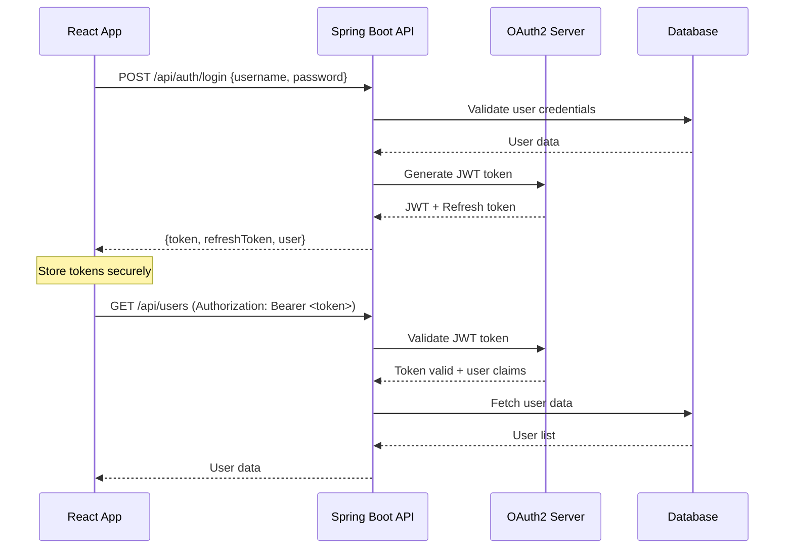

# Enterprise CLI Architecture Guide

🏗️ **Comprehensive guide to how the Enterprise CLI constructs enterprise-grade applications and the role of each framework component.**

## Table of Contents

- [Overview](#overview)
- [Backend Architecture](#backend-architecture)
- [Frontend Architecture](#frontend-architecture)
- [Integration Patterns](#integration-patterns)
- [Template System](#template-system)
- [Code Generation Flow](#code-generation-flow)
- [Framework Roles](#framework-roles)

## Overview

The Enterprise CLI implements a **layered microservice architecture** with **reactive frontend patterns**, designed to generate production-ready applications where developers focus exclusively on business logic.

### Architecture Principles

1. **Separation of Concerns**: Clear boundaries between presentation, business, and data layers
2. **Enterprise Patterns**: Circuit breakers, saga patterns, event sourcing ready
3. **Security First**: OAuth2/JWT authentication at all layers
4. **Testing Pyramid**: Unit → Integration → E2E testing at 80%+ coverage
5. **Cloud Native**: Docker/Kubernetes ready with health checks and metrics
6. **Developer Experience**: Hot reload, instant feedback, minimal configuration

## Backend Architecture

### Spring Boot 3.2.0 Enterprise Stack

The backend follows **Domain-Driven Design (DDD)** principles with **Clean Architecture** patterns:

```
┌─────────────────────────────────────────────────────────────┐
│                    🌐 Web Layer                              │
│  ┌─────────────────┐  ┌─────────────────┐  ┌─────────────────┐│
│  │  REST Controllers│  │   Security      │  │  Error Handling ││
│  │  @RestController │  │  @EnableOAuth2  │  │  @ControllerAdv ││
│  │  OpenAPI Docs   │  │  JWT Validation │  │  Global Handler ││
│  └─────────────────┘  └─────────────────┘  └─────────────────┘│
└─────────────────────────────────────────────────────────────┘
                               │
┌─────────────────────────────────────────────────────────────┐
│                 💼 Business Layer                           │
│  ┌─────────────────┐  ┌─────────────────┐  ┌─────────────────┐│
│  │   Services      │  │   Domain Logic  │  │  Integration    ││
│  │  @Service       │  │  Pure Business  │  │  Apache Camel   ││
│  │  @Transactional │  │  Rules & Events │  │  @Component     ││
│  └─────────────────┘  └─────────────────┘  └─────────────────┘│
└─────────────────────────────────────────────────────────────┘
                               │
┌─────────────────────────────────────────────────────────────┐
│                 💾 Data Layer                               │
│  ┌─────────────────┐  ┌─────────────────┐  ┌─────────────────┐│
│  │  JPA Entities   │  │   Repositories  │  │   Migrations    ││
│  │  @Entity        │  │  @Repository    │  │   Flyway SQL    ││
│  │  @Table         │  │  JpaRepository  │  │   Versioned     ││
│  └─────────────────┘  └─────────────────┘  └─────────────────┘│
└─────────────────────────────────────────────────────────────┘
```

### Core Spring Boot Dependencies

#### Security & Authentication
```xml
<dependency>
    <groupId>org.springframework.boot</groupId>
    <artifactId>spring-boot-starter-oauth2-resource-server</artifactId>
    <!-- JWT validation, OAuth2 resource server -->
</dependency>
<dependency>
    <groupId>org.springframework.boot</groupId>
    <artifactId>spring-boot-starter-security</artifactId>
    <!-- Method-level security, CORS, CSRF protection -->
</dependency>
```

**What it does**: Provides complete authentication/authorization with JWT token validation, role-based access control, and secure API endpoints.

#### Data Access & Validation
```xml
<dependency>
    <groupId>org.springframework.boot</groupId>
    <artifactId>spring-boot-starter-data-jpa</artifactId>
    <!-- JPA repositories, entity management, transactions -->
</dependency>
<dependency>
    <groupId>org.springframework.boot</groupId>
    <artifactId>spring-boot-starter-validation</artifactId>
    <!-- Bean validation, custom validators, error handling -->
</dependency>
<dependency>
    <groupId>org.flywaydb</groupId>
    <artifactId>flyway-core</artifactId>
    <!-- Database migrations, versioning, rollback -->
</dependency>
```

**What it does**: Handles all database operations with automatic repository creation, validation of input data, and managed database schema evolution.

#### Integration & Messaging
```xml
<dependency>
    <groupId>org.apache.camel</groupId>
    <artifactId>camel-spring-boot-starter</artifactId>
    <!-- Enterprise integration patterns, routing, transformation -->
</dependency>
<dependency>
    <groupId>io.github.resilience4j</groupId>
    <artifactId>resilience4j-spring-boot2</artifactId>
    <!-- Circuit breakers, retry, rate limiting, bulkhead -->
</dependency>
```

**What it does**: Provides enterprise integration patterns for connecting to legacy systems, external APIs, and implementing resilience patterns.

#### Monitoring & Operations
```xml
<dependency>
    <groupId>org.springframework.boot</groupId>
    <artifactId>spring-boot-starter-actuator</artifactId>
    <!-- Health checks, metrics, info endpoints -->
</dependency>
<dependency>
    <groupId>io.micrometer</groupId>
    <artifactId>micrometer-registry-prometheus</artifactId>
    <!-- Metrics collection, Prometheus integration -->
</dependency>
```

**What it does**: Exposes operational endpoints for health checks, metrics collection, and integration with monitoring systems like Prometheus.

### Generated File Structure

```
src/main/java/com/company/{domain}/
├── {Domain}ServiceApplication.java           # Spring Boot main class
├── config/
│   ├── SecurityConfig.java                   # OAuth2 + JWT configuration
│   ├── CamelConfig.java                      # Integration routes configuration
│   ├── DatabaseConfig.java                   # JPA + Flyway configuration
│   └── OpenAPIConfig.java                    # API documentation
├── controller/
│   ├── {Entity}Controller.java               # REST endpoints with validation
│   └── BaseController.java                   # Common controller logic
├── service/
│   ├── {Entity}Service.java                  # Business logic layer
│   └── BaseService.java                      # Common service patterns
├── domain/
│   ├── {Entity}.java                         # Pure domain objects
│   └── events/                               # Domain events
├── repository/
│   ├── {Entity}Repository.java               # JPA repositories
│   └── custom/                               # Custom query implementations
├── entity/
│   ├── {Entity}Entity.java                   # JPA entities with annotations
│   └── BaseEntity.java                       # Common entity fields (ID, timestamps)
├── integration/
│   ├── routes/                               # Apache Camel routes
│   │   ├── {Entity}Route.java               # Entity-specific integration
│   │   └── ErrorHandlingRoute.java          # Error handling patterns
│   └── processor/
│       └── {Entity}Processor.java            # Message transformation logic
├── dto/
│   ├── {Entity}CreateDTO.java                # Request DTOs with validation
│   ├── {Entity}UpdateDTO.java                # Update DTOs
│   ├── {Entity}ResponseDTO.java              # Response DTOs
│   └── mapper/
│       └── {Entity}Mapper.java               # MapStruct mappers
└── exception/
    ├── GlobalExceptionHandler.java           # Centralized error handling
    └── {Domain}Exception.java                # Domain-specific exceptions
```

### Key Backend Patterns

#### 1. Controller Pattern
```java
@RestController
@RequestMapping("/api/v1/users")
@Validated
@SecurityRequirement(name = "bearerAuth")
public class UserController extends BaseController {

    @PostMapping
    @PreAuthorize("hasRole('USER_CREATE')")
    public ResponseEntity<UserResponseDTO> createUser(
            @Valid @RequestBody UserCreateDTO createDTO) {
        // Business logic in service layer
        User user = userService.createUser(createDTO);
        return ResponseEntity.ok(userMapper.toResponseDTO(user));
    }
}
```

**What it generates**: Complete REST endpoints with validation, security, documentation, and error handling.

#### 2. Service Pattern with Transactions
```java
@Service
@Transactional
public class UserService extends BaseService<User, Long> {

    @Transactional(readOnly = true)
    public Page<User> findAllUsers(Pageable pageable) {
        return userRepository.findAll(pageable);
    }

    @Transactional
    public User createUser(UserCreateDTO createDTO) {
        // Domain validation
        validateBusinessRules(createDTO);

        // Entity creation and persistence
        User user = userMapper.toEntity(createDTO);
        User savedUser = userRepository.save(user);

        // Domain event publishing
        publishDomainEvent(new UserCreatedEvent(savedUser));

        return savedUser;
    }
}
```

**What it generates**: Transactional business logic with event publishing, validation, and error handling.

#### 3. Apache Camel Integration
```java
@Component
public class UserIntegrationRoute extends RouteBuilder {

    @Override
    public void configure() throws Exception {
        // User creation notification route
        from("direct:user-created")
            .routeId("user-notification-route")
            .log("Processing user creation: ${body}")
            .marshal().json(JsonLibrary.Jackson)
            .to("jms:queue:user.notifications")
            .to("direct:audit-log");

        // Error handling
        onException(Exception.class)
            .handled(true)
            .log("Error in user integration: ${exception.message}")
            .to("direct:error-handler");
    }
}
```

**What it generates**: Enterprise integration patterns for connecting to external systems, message queues, and legacy applications.

## Frontend Architecture

### React 18 + TypeScript Enterprise Stack

The frontend follows **Component-Driven Development** with **State Management** patterns:

```
┌─────────────────────────────────────────────────────────────┐
│                    🎨 Presentation Layer                     │
│  ┌─────────────────┐  ┌─────────────────┐  ┌─────────────────┐│
│  │     Pages       │  │   Components    │  │    Routing      ││
│  │  Route-based    │  │   Reusable UI   │  │  React Router   ││
│  │  Layout Wrapper │  │   Form Controls │  │  Protected      ││
│  └─────────────────┘  └─────────────────┘  └─────────────────┘│
└─────────────────────────────────────────────────────────────┘
                               │
┌─────────────────────────────────────────────────────────────┐
│                 🏪 State Management                         │
│  ┌─────────────────┐  ┌─────────────────┐  ┌─────────────────┐│
│  │  Redux Store    │  │   React Query   │  │  Local State    ││
│  │  Global State   │  │   Server State  │  │   Component     ││
│  │  Slices/Actions │  │   Caching       │  │   useState      ││
│  └─────────────────┘  └─────────────────┘  └─────────────────┘│
└─────────────────────────────────────────────────────────────┘
                               │
┌─────────────────────────────────────────────────────────────┐
│                 🌐 API Layer                                │
│  ┌─────────────────┐  ┌─────────────────┐  ┌─────────────────┐│
│  │   API Services  │  │   HTTP Client   │  │  Auth Handling  ││
│  │   RTK Query     │  │    Axios        │  │  Token Refresh  ││
│  │   Endpoints     │  │  Interceptors   │  │  Error Handling ││
│  └─────────────────┘  └─────────────────┘  └─────────────────┘│
└─────────────────────────────────────────────────────────────┘
```

### Core Frontend Dependencies

#### React Core & TypeScript
```json
{
  "react": "^18.2.0",
  "react-dom": "^18.2.0",
  "typescript": "^5.1.0",
  "@types/react": "^18.2.0",
  "@types/react-dom": "^18.2.0"
}
```

**What it does**: Provides the core React framework with TypeScript support for type-safe component development.

#### State Management
```json
{
  "@reduxjs/toolkit": "^1.9.5",
  "react-redux": "^8.1.1",
  "@tanstack/react-query": "^4.29.0"
}
```

**What it does**:
- **Redux Toolkit**: Global state management with simplified store setup and immutable updates
- **React Query**: Server state management with caching, background updates, and optimistic updates

#### UI Framework (Material-UI Example)
```json
{
  "@mui/material": "^5.13.6",
  "@mui/icons-material": "^5.13.6",
  "@emotion/react": "^11.11.1",
  "@emotion/styled": "^11.11.0"
}
```

**What it does**: Provides enterprise-grade UI components with theming, accessibility, and responsive design.

#### Routing & Navigation
```json
{
  "react-router-dom": "^6.14.0"
}
```

**What it does**: Client-side routing with protected routes, navigation guards, and nested routing patterns.

#### Form Handling & Validation
```json
{
  "react-hook-form": "^7.45.0",
  "yup": "^1.2.0",
  "@hookform/resolvers": "^3.1.1"
}
```

**What it does**: Performant form handling with validation schemas and error management.

### Generated Frontend Structure

```
src/
├── components/                               # Reusable UI components
│   ├── common/
│   │   ├── Button/                           # Custom button component
│   │   ├── Input/                            # Form input components
│   │   ├── Modal/                            # Modal component
│   │   └── DataTable/                        # Enterprise data table
│   ├── layout/
│   │   ├── Header/                           # Application header
│   │   ├── Sidebar/                          # Navigation sidebar
│   │   └── Footer/                           # Application footer
│   └── forms/
│       ├── UserForm/                         # User-specific forms
│       └── BaseForm/                         # Common form patterns
├── pages/                                    # Route-based page components
│   ├── auth/
│   │   ├── LoginPage.tsx                     # Login with JWT
│   │   ├── RegisterPage.tsx                  # User registration
│   │   └── ForgotPasswordPage.tsx            # Password reset
│   ├── dashboard/
│   │   └── DashboardPage.tsx                 # Main dashboard
│   └── users/
│       ├── UsersListPage.tsx                 # User listing with pagination
│       ├── UserDetailsPage.tsx               # User details view
│       └── CreateUserPage.tsx                # User creation form
├── store/                                    # Redux store configuration
│   ├── index.ts                              # Store setup with middleware
│   ├── api/
│   │   ├── apiSlice.ts                       # RTK Query base API
│   │   ├── userApi.ts                        # User API endpoints
│   │   └── authApi.ts                        # Authentication API
│   └── slices/
│       ├── authSlice.ts                      # Authentication state
│       ├── uiSlice.ts                        # UI state (modals, loading)
│       └── userSlice.ts                      # User management state
├── hooks/                                    # Custom React hooks
│   ├── useAuth.ts                            # Authentication hook
│   ├── useCrud.ts                            # Generic CRUD operations
│   ├── useForm.ts                            # Form handling hook
│   └── useApi.ts                             # API interaction hook
├── services/                                 # API service layer
│   ├── apiClient.ts                          # Axios configuration
│   ├── authService.ts                        # Authentication services
│   └── userService.ts                        # User API services
├── utils/                                    # Utility functions
│   ├── validation.ts                         # Validation schemas
│   ├── formatters.ts                         # Data formatters
│   └── constants.ts                          # Application constants
├── types/                                    # TypeScript type definitions
│   ├── api.ts                                # API response types
│   ├── auth.ts                               # Authentication types
│   └── user.ts                               # User entity types
└── styles/                                   # Global styles and theme
    ├── theme.ts                              # Material-UI theme
    ├── globals.css                           # Global CSS
    └── variables.css                         # CSS variables
```

### Key Frontend Patterns

#### 1. Custom CRUD Hook
```typescript
export const useCrud = <T, CreateDTO, UpdateDTO>(
  entityName: string,
  apiEndpoint: string
) => {
  const [entities, setEntities] = useState<T[]>([]);
  const [loading, setLoading] = useState(false);
  const [error, setError] = useState<string | null>(null);

  const createEntity = async (data: CreateDTO): Promise<T> => {
    setLoading(true);
    try {
      const response = await apiClient.post<T>(`${apiEndpoint}`, data);
      setEntities(prev => [...prev, response.data]);
      return response.data;
    } catch (err) {
      setError(`Failed to create ${entityName}`);
      throw err;
    } finally {
      setLoading(false);
    }
  };

  const updateEntity = async (id: string | number, data: UpdateDTO): Promise<T> => {
    // Implementation for update
  };

  const deleteEntity = async (id: string | number): Promise<void> => {
    // Implementation for delete
  };

  const fetchEntities = async (): Promise<T[]> => {
    // Implementation for fetch
  };

  return {
    entities,
    loading,
    error,
    createEntity,
    updateEntity,
    deleteEntity,
    fetchEntities,
  };
};
```

**What it generates**: Reusable CRUD operations that work with any entity type, reducing boilerplate code.

#### 2. Protected Route Component
```typescript
interface ProtectedRouteProps {
  children: React.ReactNode;
  requiredRoles?: string[];
  requiredPermissions?: string[];
}

export const ProtectedRoute: React.FC<ProtectedRouteProps> = ({
  children,
  requiredRoles = [],
  requiredPermissions = [],
}) => {
  const { user, isAuthenticated } = useAuth();
  const location = useLocation();

  if (!isAuthenticated) {
    return <Navigate to="/login" state={{ from: location }} replace />;
  }

  if (requiredRoles.length > 0 && !hasRequiredRoles(user, requiredRoles)) {
    return <Navigate to="/unauthorized" replace />;
  }

  if (requiredPermissions.length > 0 && !hasRequiredPermissions(user, requiredPermissions)) {
    return <Navigate to="/unauthorized" replace />;
  }

  return <>{children}</>;
};
```

**What it generates**: Route protection with role-based and permission-based access control.

#### 3. Error Boundary with Recovery
```typescript
interface ErrorBoundaryState {
  hasError: boolean;
  error: Error | null;
  errorInfo: ErrorInfo | null;
}

export class ErrorBoundary extends Component<
  PropsWithChildren<{}>,
  ErrorBoundaryState
> {
  constructor(props: PropsWithChildren<{}>) {
    super(props);
    this.state = { hasError: false, error: null, errorInfo: null };
  }

  static getDerivedStateFromError(error: Error): ErrorBoundaryState {
    return { hasError: true, error, errorInfo: null };
  }

  componentDidCatch(error: Error, errorInfo: ErrorInfo) {
    this.setState({ errorInfo });
    // Log error to monitoring service
    logErrorToService(error, errorInfo);
  }

  handleReset = () => {
    this.setState({ hasError: false, error: null, errorInfo: null });
  };

  render() {
    if (this.state.hasError) {
      return (
        <ErrorFallback
          error={this.state.error}
          onReset={this.handleReset}
        />
      );
    }

    return this.props.children;
  }
}
```

**What it generates**: Comprehensive error handling with user-friendly error displays and recovery options.

## Integration Patterns

### Backend-Frontend Communication

#### API Integration Flow
```
┌─────────────────┐    ┌─────────────────┐    ┌─────────────────┐
│   React App     │    │  Spring Boot    │    │   Database      │
│                 │    │   REST API      │    │                 │
│  ┌─────────────┐│    │ ┌─────────────┐ │    │ ┌─────────────┐ │
│  │ RTK Query   ││ ───┤ │ Controllers │ │────┤ │ JPA Entities│ │
│  │ Endpoints   ││    │ │ @RequestMap │ │    │ │ @Entity     │ │
│  └─────────────┘│    │ └─────────────┘ │    │ └─────────────┘ │
│                 │    │                 │    │                 │
│  ┌─────────────┐│    │ ┌─────────────┐ │    │ ┌─────────────┐ │
│  │Auth Service ││ ───┤ │Security     │ │    │ │Flyway       │ │
│  │JWT Handling ││    │ │OAuth2 + JWT │ │    │ │Migrations   │ │
│  └─────────────┘│    │ └─────────────┘ │    │ └─────────────┘ │
└─────────────────┘    └─────────────────┘    └─────────────────┘
        │                       │                       │
        │ HTTP + JSON           │ JDBC                  │
        │ Authorization: Bearer │ Connection Pool       │
        └───────────────────────┴───────────────────────┘
```

#### Authentication Flow


## Template System

### Mustache Templating Engine

The CLI uses **Mustache** for code generation with conditional compilation:

#### Template Variables
```javascript
// Generated template context
const templateVars = {
  serviceName: 'user-service',
  serviceNamePascalCase: 'UserService',
  serviceNameCamelCase: 'userService',
  packageName: 'com.company.user',
  entities: ['User', 'Profile'],
  hasAuth: true,
  hasDocker: true,
  hasK8s: true,
  database: 'postgresql',
  uiFramework: 'material-ui',
  hasTypeScript: true,
  hasRedux: true
};
```

#### Conditional Template Example
```java
@RestController
@RequestMapping("/api/v1/{{entityNameLowerCase}}")
{{#hasAuth}}
@SecurityRequirement(name = "bearerAuth")
{{/hasAuth}}
public class {{entityNamePascalCase}}Controller {

    {{#hasAuth}}
    @PreAuthorize("hasRole('{{entityNameUpperCase}}_READ')")
    {{/hasAuth}}
    @GetMapping
    public ResponseEntity<Page<{{entityNamePascalCase}}ResponseDTO>> getAll(
            Pageable pageable) {
        // Generated method implementation
    }
}
```

#### Frontend Template Example
```typescript
{{#hasTypeScript}}
interface {{entityNamePascalCase}}Props {
  {{entityNameLowerCase}}: {{entityNamePascalCase}};
  onEdit?: ({{entityNameLowerCase}}: {{entityNamePascalCase}}) => void;
  onDelete?: (id: string) => void;
}
{{/hasTypeScript}}

export const {{entityNamePascalCase}}Card{{#hasTypeScript}}: React.FC<{{entityNamePascalCase}}Props>{{/hasTypeScript}} = ({
  {{entityNameLowerCase}},
  onEdit,
  onDelete,
}) => {
  {{#isMaterialUI}}
  return (
    <Card>
      <CardContent>
        <Typography variant="h6">
          {{{entityNameLowerCase}}.name}
        </Typography>
      </CardContent>
    </Card>
  );
  {{/isMaterialUI}}
  {{#isAntDesign}}
  return (
    <Card title={{{entityNameLowerCase}}.name}>
      {/* Ant Design implementation */}
    </Card>
  );
  {{/isAntDesign}}
};
```

## Code Generation Flow

### 1. Command Processing
```javascript
// src/commands/generate.js
const generateMicroservice = async (serviceName, options) => {
  // 1. Validate input parameters
  validateServiceName(serviceName);

  // 2. Collect configuration through prompts
  const config = await collectConfiguration(options);

  // 3. Generate template variables
  const templateVars = createTemplateVariables(serviceName, config);

  // 4. Process templates
  await processTemplates('microservice-skeleton', templateVars);

  // 5. Initialize project structure
  await initializeProject(serviceName, config);

  // 6. Run post-generation tasks
  await runPostGenerationTasks(config);
};
```

### 2. Template Processing
```javascript
const processTemplates = async (templateDir, vars) => {
  const templateFiles = await glob(`${templateDir}/**/*`);

  for (const templateFile of templateFiles) {
    // 1. Read template content
    const content = await fs.readFile(templateFile, 'utf8');

    // 2. Process Mustache template
    const processedContent = Mustache.render(content, vars);

    // 3. Resolve output path
    const outputPath = resolveOutputPath(templateFile, vars);

    // 4. Write processed file
    await fs.writeFile(outputPath, processedContent);
  }
};
```

### 3. Project Initialization
```javascript
const initializeProject = async (serviceName, config) => {
  // 1. Initialize Maven project
  if (config.hasBackend) {
    await executeMavenCommands(serviceName);
  }

  // 2. Initialize NPM project
  if (config.hasFrontend) {
    await executeNpmCommands(serviceName);
  }

  // 3. Setup Docker environment
  if (config.hasDocker) {
    await setupDockerEnvironment(serviceName);
  }

  // 4. Setup Kubernetes manifests
  if (config.hasK8s) {
    await setupKubernetesManifests(serviceName);
  }
};
```

## Framework Roles

### Spring Boot Framework Components

| Component | Role | Generated Files | Developer Responsibility |
|-----------|------|-----------------|------------------------|
| **Spring Web** | REST API layer | Controllers, DTOs, Exception handlers | Business logic implementation |
| **Spring Security** | Authentication/Authorization | Security configs, JWT validation | Custom security rules |
| **Spring Data JPA** | Data access layer | Entities, Repositories, Migrations | Entity relationships, custom queries |
| **Apache Camel** | Integration layer | Routes, Processors, Configs | Business-specific integrations |
| **Spring Boot Actuator** | Monitoring/Health | Health checks, Metrics endpoints | Custom health indicators |
| **Flyway** | Database migrations | Migration scripts, Schema versioning | Data migration scripts |

### React Framework Components

| Component | Role | Generated Files | Developer Responsibility |
|-----------|------|-----------------|------------------------|
| **React Router** | Client-side routing | Route definitions, Protected routes | Business-specific routes |
| **Redux Toolkit** | Global state management | Store, Slices, Actions | Business state logic |
| **React Query** | Server state management | API endpoints, Caching | Business-specific queries |
| **Material-UI/Ant Design** | UI components | Theme, Components, Layout | Custom component styling |
| **React Hook Form** | Form handling | Form components, Validation | Business-specific forms |
| **Jest + RTL** | Testing framework | Test utilities, Setup | Business logic tests |

---

**Next**: [Tutorial Guide](TUTORIAL.md) - Step-by-step examples for junior developers