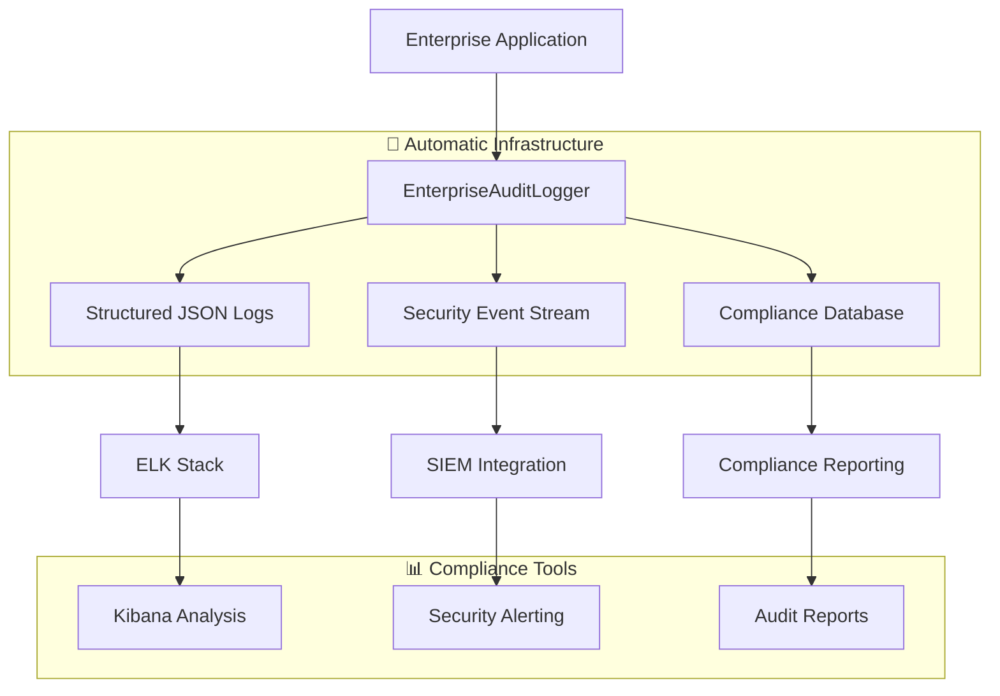

# Enterprise Framework - Audit Trails & Compliance Guide

🔒 **Complete guide for audit trails, compliance monitoring, and security event tracking in Enterprise Framework applications.**

This guide demonstrates how the Enterprise Framework provides **automatic compliance-grade audit trails** with comprehensive security event logging, data access tracking, and business rule violation monitoring.

## 🎯 **Overview**

The Enterprise Framework automatically generates **enterprise-grade audit trails** that meet compliance requirements for:

- **SOX (Sarbanes-Oxley)** - Financial data access and modification tracking
- **GDPR (General Data Protection Regulation)** - Personal data access and processing logs
- **HIPAA (Health Insurance Portability)** - Healthcare data access control
- **PCI DSS (Payment Card Industry)** - Payment data security compliance
- **ISO 27001** - Information security management
- **Internal Audit Requirements** - Business process tracking and validation

## 🏗️ **Audit Architecture**



### Audit Event Categories

#### **🤖 Automatic Audit Events (Infrastructure)**
- **Operation Events**: All CRUD operations with full context
- **Security Events**: Authentication, authorization, access control
- **System Events**: Configuration changes, system errors
- **Data Access Events**: Every data read/write operation

#### **👨‍💻 Business Audit Events (Developer Customizable)**
- **Business Rule Violations**: Domain-specific policy violations
- **Workflow Events**: Business process state changes
- **Approval Events**: Business decision and approval tracking
- **External Integration Events**: Third-party system interactions

## 📋 **Audit Event Structure**

### Complete Audit Event Schema

```json
{
  "auditId": "uuid-v4-generated",
  "timestamp": "2024-01-15T10:30:00.123Z",
  "eventType": "OPERATION_SUCCESS",
  "operation": "CREATE|READ|UPDATE|DELETE|SEARCH",
  "entityType": "PRODUCT|CUSTOMER|ORDER|USER",
  "entityId": "entity-identifier",
  "status": "SUCCESS|FAILED|VIOLATION|ERROR",

  "security": {
    "userId": "user@company.com",
    "userRole": "ROLE_ADMIN,ROLE_MANAGER",
    "sessionId": "session-uuid",
    "clientIpAddress": "192.168.1.100",
    "userAgent": "Mozilla/5.0...",
    "authenticationMethod": "JWT|BASIC|OAUTH2"
  },

  "request": {
    "correlationId": "request-correlation-id",
    "requestMethod": "POST|GET|PUT|DELETE",
    "requestUri": "/api/v1/products",
    "requestData": {
      "name": "Product Name",
      "price": 299.99,
      "category": "ELECTRONICS"
    }
  },

  "response": {
    "responseStatus": 200,
    "responseData": {
      "id": "PROD-123",
      "status": "ACTIVE"
    },
    "processingTimeMs": 150
  },

  "business": {
    "businessContext": "PRODUCT_MANAGEMENT",
    "workflowStep": "INITIAL_CREATION",
    "approvalRequired": false,
    "ruleType": "VALIDATION|APPROVAL|NOTIFICATION",
    "ruleDescription": "Product name must be unique"
  },

  "compliance": {
    "dataClassification": "PUBLIC|INTERNAL|CONFIDENTIAL|RESTRICTED",
    "retentionPolicy": "7_YEARS",
    "encryptionApplied": true,
    "gdprRelevant": true,
    "soxRelevant": false
  },

  "error": {
    "errorMessage": "Validation failed",
    "errorType": "BusinessValidationException",
    "stackTrace": "stack-trace-if-system-error"
  }
}
```

## 🛡️ **Automatic Audit Events**

### 1. **Operation Audit Events**

#### **Successful Operations**
```json
{
  "auditId": "op-success-uuid",
  "timestamp": "2024-01-15T10:30:00Z",
  "eventType": "OPERATION_SUCCESS",
  "operation": "CREATE",
  "entityType": "PRODUCT",
  "entityId": "PROD-123",
  "status": "SUCCESS",
  "security": {
    "userId": "product.manager@company.com",
    "userRole": "ROLE_PRODUCT_MANAGER",
    "sessionId": "sess-uuid-123"
  },
  "request": {
    "correlationId": "req-corr-456",
    "requestMethod": "POST",
    "requestUri": "/api/v1/products",
    "requestData": {
      "name": "Enterprise Laptop",
      "price": 1299.99,
      "category": "ELECTRONICS"
    }
  },
  "response": {
    "responseStatus": 201,
    "responseData": {
      "id": "PROD-123",
      "businessId": "ELECTRONICS-001",
      "status": "ACTIVE"
    },
    "processingTimeMs": 145
  },
  "compliance": {
    "dataClassification": "INTERNAL",
    "retentionPolicy": "7_YEARS",
    "gdprRelevant": false,
    "soxRelevant": true
  }
}
```

#### **Failed Operations**
```json
{
  "auditId": "op-failed-uuid",
  "timestamp": "2024-01-15T10:35:00Z",
  "eventType": "OPERATION_FAILED",
  "operation": "UPDATE",
  "entityType": "PRODUCT",
  "entityId": "PROD-123",
  "status": "VALIDATION_FAILED",
  "security": {
    "userId": "junior.dev@company.com",
    "userRole": "ROLE_DEVELOPER"
  },
  "request": {
    "requestData": {
      "price": -100.00
    }
  },
  "error": {
    "errorMessage": "Price cannot be negative",
    "errorType": "BusinessValidationException"
  },
  "business": {
    "ruleType": "PRICE_VALIDATION",
    "ruleDescription": "Product price must be positive"
  }
}
```

### 2. **Security Audit Events**

#### **Authentication Events**
```json
{
  "auditId": "auth-uuid",
  "timestamp": "2024-01-15T08:00:00Z",
  "eventType": "SECURITY_EVENT",
  "operation": "AUTHENTICATION",
  "status": "SUCCESS",
  "security": {
    "userId": "user@company.com",
    "clientIpAddress": "192.168.1.100",
    "authenticationMethod": "JWT",
    "sessionId": "new-session-uuid"
  },
  "business": {
    "businessContext": "USER_LOGIN"
  },
  "compliance": {
    "securityRelevant": true,
    "retentionPolicy": "10_YEARS"
  }
}
```

#### **Authorization Failures**
```json
{
  "auditId": "authz-fail-uuid",
  "timestamp": "2024-01-15T10:45:00Z",
  "eventType": "SECURITY_EVENT",
  "operation": "AUTHORIZATION_DENIED",
  "status": "ACCESS_DENIED",
  "security": {
    "userId": "read.only@company.com",
    "userRole": "ROLE_VIEWER",
    "clientIpAddress": "192.168.1.200"
  },
  "request": {
    "requestMethod": "DELETE",
    "requestUri": "/api/v1/products/PROD-123"
  },
  "business": {
    "businessContext": "INSUFFICIENT_PRIVILEGES",
    "ruleDescription": "ROLE_VIEWER cannot delete products"
  },
  "compliance": {
    "securityRelevant": true
  }
}
```

### 3. **Data Access Audit Events**

#### **Sensitive Data Access**
```json
{
  "auditId": "data-access-uuid",
  "timestamp": "2024-01-15T11:00:00Z",
  "eventType": "DATA_ACCESS",
  "operation": "READ",
  "entityType": "CUSTOMER",
  "entityId": "CUST-456",
  "status": "ACCESSED",
  "security": {
    "userId": "support@company.com",
    "userRole": "ROLE_SUPPORT"
  },
  "business": {
    "businessContext": "CUSTOMER_SUPPORT",
    "accessReason": "Customer inquiry resolution"
  },
  "compliance": {
    "dataClassification": "CONFIDENTIAL",
    "gdprRelevant": true,
    "encryptionApplied": true
  }
}
```

### 4. **Configuration Change Events**
```json
{
  "auditId": "config-change-uuid",
  "timestamp": "2024-01-15T12:00:00Z",
  "eventType": "CONFIGURATION_CHANGE",
  "operation": "CONFIG_UPDATE",
  "entityType": "SYSTEM_CONFIGURATION",
  "entityId": "database.connection.pool.size",
  "status": "CHANGED",
  "security": {
    "userId": "admin@company.com",
    "userRole": "ROLE_SYSTEM_ADMIN"
  },
  "request": {
    "previousData": {"value": "10"},
    "responseData": {"value": "20"}
  },
  "business": {
    "businessContext": "PERFORMANCE_OPTIMIZATION",
    "approvalRequired": true,
    "approvalTicket": "TICKET-789"
  }
}
```

## 👨‍💻 **Custom Business Audit Events**

### Business Rule Violations

```java
@Component
public class ProductBusinessRules extends BusinessRules.AbstractBusinessRules<Product, ProductRequest, ProductRequest> {

    @Autowired
    private EnterpriseAuditLogger auditLogger;

    @Override
    public void applyCreateRules(Product entity, ProductRequest createDTO) {
        // 👨‍💻 Custom business rule with audit
        if (entity.getPrice().compareTo(BigDecimal.valueOf(10000)) > 0) {
            auditLogger.logBusinessRuleViolation(
                "PRODUCT",
                entity.getId(),
                "PRICE_LIMIT_EXCEEDED",
                "Product price exceeds $10,000 limit - requires approval"
            );

            // Trigger approval workflow
            triggerApprovalWorkflow(entity);
        }

        // 👨‍💻 Log configuration changes that affect business logic
        if (createDTO.getCategory() != null &&
            !createDTO.getCategory().equals(entity.getCategory())) {

            auditLogger.logConfigurationChange(
                "PRODUCT_CATEGORY",
                "category_change",
                entity.getCategory(),
                createDTO.getCategory()
            );
        }
    }
}
```

### Workflow Events

```java
@Service
public class OrderApprovalService {

    @Autowired
    private EnterpriseAuditLogger auditLogger;

    public void approveOrder(String orderId, String approverId, String reason) {
        try {
            // Process approval
            Order order = orderService.findById(orderId);
            order.setStatus(OrderStatus.APPROVED);
            order.setApprovedBy(approverId);
            order.setApprovedAt(Instant.now());

            // 👨‍💻 Log approval decision
            auditLogger.logBusinessEvent(
                "ORDER_APPROVED",
                "ORDER",
                orderId,
                Map.of(
                    "approverId", approverId,
                    "reason", reason,
                    "orderValue", order.getTotalValue(),
                    "approvalLevel", determineApprovalLevel(order)
                )
            );

            orderService.save(order);

        } catch (Exception e) {
            // 👨‍💻 Log approval failure
            auditLogger.logSystemError("ORDER_APPROVAL", "ORDER", orderId, e);
            throw e;
        }
    }
}
```

### External Integration Audit

```java
@Service
public class PaymentIntegrationService {

    @Autowired
    private EnterpriseAuditLogger auditLogger;

    public PaymentResult processPayment(PaymentRequest request) {
        String correlationId = UUID.randomUUID().toString();

        // 👨‍💻 Log external integration start
        auditLogger.logExternalIntegration(
            "PAYMENT_PROCESSING_START",
            "PAYMENT_GATEWAY",
            request.getOrderId(),
            Map.of(
                "correlationId", correlationId,
                "amount", request.getAmount(),
                "currency", request.getCurrency(),
                "paymentMethod", request.getPaymentMethod()
            )
        );

        try {
            PaymentResult result = paymentGateway.process(request);

            // 👨‍💻 Log successful integration
            auditLogger.logExternalIntegration(
                "PAYMENT_PROCESSING_SUCCESS",
                "PAYMENT_GATEWAY",
                request.getOrderId(),
                Map.of(
                    "correlationId", correlationId,
                    "transactionId", result.getTransactionId(),
                    "status", result.getStatus()
                )
            );

            return result;

        } catch (PaymentException e) {
            // 👨‍💻 Log integration failure
            auditLogger.logExternalIntegration(
                "PAYMENT_PROCESSING_FAILED",
                "PAYMENT_GATEWAY",
                request.getOrderId(),
                Map.of(
                    "correlationId", correlationId,
                    "errorCode", e.getErrorCode(),
                    "errorMessage", e.getMessage()
                )
            );
            throw e;
        }
    }
}
```

## 📊 **Audit Analysis & Queries**

### Elasticsearch/Kibana Queries

#### **1. SOX Compliance Queries**

**Financial Data Modifications**
```json
{
  "query": {
    "bool": {
      "must": [
        {"term": {"compliance.soxRelevant": true}},
        {"terms": {"operation": ["CREATE", "UPDATE", "DELETE"]}},
        {"range": {"timestamp": {"gte": "2024-01-01", "lte": "2024-12-31"}}}
      ]
    }
  },
  "aggs": {
    "by_user": {
      "terms": {"field": "security.userId"},
      "aggs": {
        "by_entity": {"terms": {"field": "entityType"}}
      }
    },
    "by_month": {
      "date_histogram": {
        "field": "timestamp",
        "calendar_interval": "month"
      }
    }
  },
  "sort": [{"timestamp": {"order": "desc"}}]
}
```

**User Access Patterns**
```json
{
  "query": {
    "bool": {
      "must": [
        {"term": {"security.userId": "financial.analyst@company.com"}},
        {"term": {"compliance.soxRelevant": true}},
        {"range": {"timestamp": {"gte": "now-30d"}}}
      ]
    }
  },
  "aggs": {
    "access_times": {
      "date_histogram": {
        "field": "timestamp",
        "calendar_interval": "hour"
      }
    },
    "accessed_entities": {
      "terms": {"field": "entityType"}
    }
  }
}
```

#### **2. GDPR Compliance Queries**

**Personal Data Access Tracking**
```json
{
  "query": {
    "bool": {
      "must": [
        {"term": {"compliance.gdprRelevant": true}},
        {"term": {"eventType": "DATA_ACCESS"}},
        {"wildcard": {"entityId": "CUSTOMER-*"}},
        {"range": {"timestamp": {"gte": "now-7d"}}}
      ]
    }
  },
  "aggs": {
    "by_user": {"terms": {"field": "security.userId"}},
    "by_purpose": {"terms": {"field": "business.accessReason"}},
    "by_data_type": {"terms": {"field": "entityType"}}
  }
}
```

**Data Subject Rights Requests**
```json
{
  "query": {
    "bool": {
      "must": [
        {"term": {"business.businessContext": "GDPR_REQUEST"}},
        {"terms": {"operation": ["DATA_EXPORT", "DATA_DELETION", "DATA_CORRECTION"]}}
      ]
    }
  },
  "sort": [{"timestamp": {"order": "desc"}}]
}
```

#### **3. Security Event Analysis**

**Failed Authentication Attempts**
```json
{
  "query": {
    "bool": {
      "must": [
        {"term": {"eventType": "SECURITY_EVENT"}},
        {"term": {"operation": "AUTHENTICATION"}},
        {"term": {"status": "FAILED"}},
        {"range": {"timestamp": {"gte": "now-24h"}}}
      ]
    }
  },
  "aggs": {
    "by_ip": {"terms": {"field": "security.clientIpAddress"}},
    "by_user": {"terms": {"field": "security.userId"}},
    "attack_timeline": {
      "date_histogram": {
        "field": "timestamp",
        "fixed_interval": "1h"
      }
    }
  }
}
```

**Privilege Escalation Attempts**
```json
{
  "query": {
    "bool": {
      "must": [
        {"term": {"eventType": "SECURITY_EVENT"}},
        {"term": {"operation": "AUTHORIZATION_DENIED"}},
        {"term": {"business.businessContext": "INSUFFICIENT_PRIVILEGES"}}
      ]
    }
  },
  "aggs": {
    "by_user": {"terms": {"field": "security.userId"}},
    "by_resource": {"terms": {"field": "request.requestUri"}}
  }
}
```

#### **4. Business Rule Compliance**

**Business Rule Violations Trend**
```json
{
  "query": {
    "bool": {
      "must": [
        {"term": {"eventType": "BUSINESS_RULE_VIOLATION"}},
        {"range": {"timestamp": {"gte": "now-30d"}}}
      ]
    }
  },
  "aggs": {
    "by_rule_type": {"terms": {"field": "business.ruleType"}},
    "by_entity_type": {"terms": {"field": "entityType"}},
    "violation_trend": {
      "date_histogram": {
        "field": "timestamp",
        "calendar_interval": "day"
      }
    }
  }
}
```

**Approval Workflow Tracking**
```json
{
  "query": {
    "bool": {
      "must": [
        {"term": {"business.approvalRequired": true}},
        {"range": {"timestamp": {"gte": "now-7d"}}}
      ]
    }
  },
  "aggs": {
    "approval_status": {"terms": {"field": "status"}},
    "by_approver": {"terms": {"field": "business.approverId"}},
    "processing_time": {
      "histogram": {
        "field": "response.processingTimeMs",
        "interval": 1000
      }
    }
  }
}
```

## 📈 **Compliance Reporting**

### Automated Compliance Reports

#### **1. SOX Financial Controls Report**

```java
@Service
public class SOXComplianceReportService {

    @Autowired
    private AuditEventRepository auditEventRepository;

    public SOXComplianceReport generateQuarterlyReport(LocalDate startDate, LocalDate endDate) {
        // Query financial data access and modifications
        List<AuditEvent> financialEvents = auditEventRepository.findBySOXRelevant(
            startDate.atStartOfDay(),
            endDate.atTime(23, 59, 59)
        );

        return SOXComplianceReport.builder()
            .reportPeriod(startDate + " to " + endDate)
            .totalFinancialTransactions(countTransactions(financialEvents))
            .unauthorizedAccessAttempts(countUnauthorizedAccess(financialEvents))
            .configurationChanges(countConfigChanges(financialEvents))
            .userAccessPatterns(analyzeUserAccess(financialEvents))
            .controlEffectiveness(calculateControlEffectiveness(financialEvents))
            .recommendations(generateRecommendations(financialEvents))
            .build();
    }
}
```

#### **2. GDPR Data Processing Report**

```java
@Service
public class GDPRComplianceReportService {

    public GDPRProcessingReport generateDataProcessingReport(String dataSubjectId) {
        List<AuditEvent> dataProcessingEvents = auditEventRepository.findGDPRRelevantBySubject(dataSubjectId);

        return GDPRProcessingReport.builder()
            .dataSubjectId(dataSubjectId)
            .dataAccessEvents(filterAccessEvents(dataProcessingEvents))
            .dataModificationEvents(filterModificationEvents(dataProcessingEvents))
            .dataRetentionCompliance(checkRetentionCompliance(dataProcessingEvents))
            .consentTracking(trackConsentChanges(dataProcessingEvents))
            .thirdPartySharing(trackThirdPartySharing(dataProcessingEvents))
            .dataSubjectRights(trackRightsExercised(dataProcessingEvents))
            .build();
    }
}
```

### Real-time Compliance Monitoring

```java
@Component
public class ComplianceMonitor {

    @EventListener
    public void onAuditEvent(AuditEventPublishedEvent event) {
        AuditEvent auditEvent = event.getAuditEvent();

        // Real-time SOX monitoring
        if (auditEvent.getCompliance().isSoxRelevant()) {
            checkSOXCompliance(auditEvent);
        }

        // Real-time GDPR monitoring
        if (auditEvent.getCompliance().isGdprRelevant()) {
            checkGDPRCompliance(auditEvent);
        }

        // Security event monitoring
        if (auditEvent.getCompliance().isSecurityRelevant()) {
            checkSecurityCompliance(auditEvent);
        }
    }

    private void checkSOXCompliance(AuditEvent event) {
        // Check for financial controls violations
        if (isFinancialDataModification(event) && !hasProperApproval(event)) {
            alertingService.sendSOXViolationAlert(event);
        }
    }

    private void checkGDPRCompliance(AuditEvent event) {
        // Check for GDPR violations
        if (isPersonalDataAccess(event) && !hasLegalBasis(event)) {
            alertingService.sendGDPRViolationAlert(event);
        }
    }
}
```

## 🔧 **Development & Testing**

### Audit Testing

```java
@SpringBootTest
@TestPropertySource(properties = {
    "logging.level.AUDIT=DEBUG",
    "management.endpoints.web.exposure.include=*"
})
public class AuditTrailIntegrationTest {

    @Autowired
    private ProductService productService;

    @Autowired
    private TestAuditEventCaptor auditCaptor;

    @Test
    public void testProductCreationAudit() {
        // Given
        ProductRequest request = new ProductRequest("Test Product", BigDecimal.valueOf(100));

        // When
        ProductResponse response = productService.create(request);

        // Then
        List<AuditEvent> auditEvents = auditCaptor.getCapturedEvents();

        assertThat(auditEvents).hasSize(1);
        AuditEvent event = auditEvents.get(0);

        assertThat(event.getEventType()).isEqualTo("OPERATION_SUCCESS");
        assertThat(event.getOperation()).isEqualTo("CREATE");
        assertThat(event.getEntityType()).isEqualTo("PRODUCT");
        assertThat(event.getEntityId()).isEqualTo(response.getId());
        assertThat(event.getStatus()).isEqualTo("SUCCESS");
    }

    @Test
    public void testBusinessRuleViolationAudit() {
        // Given
        ProductRequest invalidRequest = new ProductRequest("", BigDecimal.valueOf(-100));

        // When
        assertThatThrownBy(() -> productService.create(invalidRequest))
            .isInstanceOf(BusinessValidationException.class);

        // Then
        List<AuditEvent> auditEvents = auditCaptor.getCapturedEvents();
        AuditEvent violationEvent = auditEvents.stream()
            .filter(e -> "BUSINESS_RULE_VIOLATION".equals(e.getEventType()))
            .findFirst()
            .orElseThrow();

        assertThat(violationEvent.getBusiness().getRuleType()).isEqualTo("PRICE_VALIDATION");
    }
}
```

### Audit Performance Testing

```java
@Test
public void testAuditPerformanceImpact() {
    // Measure performance with audit enabled
    StopWatch stopWatch = new StopWatch();

    stopWatch.start();
    for (int i = 0; i < 1000; i++) {
        productService.create(generateTestProduct());
    }
    stopWatch.stop();

    long timeWithAudit = stopWatch.getTotalTimeMillis();

    // Audit should add minimal overhead (< 5% performance impact)
    assertThat(timeWithAudit).isLessThan(baselineTime * 1.05);
}
```

## 🚀 **Production Deployment**

### Audit Configuration

```yaml
# application-prod.yml
logging:
  level:
    AUDIT: INFO
    SECURITY: WARN
  pattern:
    file: "%d{ISO8601} [%X{correlationId}] [%X{userId}] %-5level %logger{36} - %msg%n"

enterprise:
  audit:
    enabled: true
    retention-days: 2555  # 7 years for SOX compliance
    encryption: true
    async: true
    batch-size: 100
    targets:
      - type: elasticsearch
        url: ${ELASTICSEARCH_URL}
        index: audit-events-${spring.profiles.active}
      - type: database
        table: audit_events
        encryption: true
      - type: siem
        url: ${SIEM_ENDPOINT}
        api-key: ${SIEM_API_KEY}

  compliance:
    sox:
      enabled: true
      financial-entities: ["ORDER", "PAYMENT", "INVOICE"]
    gdpr:
      enabled: true
      personal-data-entities: ["CUSTOMER", "USER", "CONTACT"]
    retention:
      default: "7_YEARS"
      gdpr: "3_YEARS"
      security: "10_YEARS"
```

### Kubernetes Deployment

```yaml
# k8s/audit-config.yaml
apiVersion: v1
kind: ConfigMap
metadata:
  name: audit-config
data:
  audit.properties: |
    enterprise.audit.enabled=true
    enterprise.audit.async=true
    enterprise.audit.encryption=true

---
apiVersion: apps/v1
kind: Deployment
metadata:
  name: enterprise-app
spec:
  template:
    spec:
      containers:
      - name: app
        env:
        - name: ELASTICSEARCH_URL
          value: "http://elasticsearch:9200"
        - name: AUDIT_ENCRYPTION_KEY
          valueFrom:
            secretKeyRef:
              name: audit-secrets
              key: encryption-key
        volumeMounts:
        - name: audit-logs
          mountPath: /app/logs/audit
        - name: audit-config
          mountPath: /app/config/audit
      volumes:
      - name: audit-logs
        persistentVolumeClaim:
          claimName: audit-logs-pvc
      - name: audit-config
        configMap:
          name: audit-config
```

---

**Enterprise Framework Audit Trails** - Automatic compliance-grade audit trails with comprehensive security event tracking.

> 🔒 **Compliance First**: Built-in SOX, GDPR, HIPAA, and PCI DSS compliance with automatic audit trail generation that meets enterprise audit requirements.

> 🎯 **Zero Configuration**: **Comprehensive audit trails** work automatically with structured JSON events, retention policies, and compliance reporting from day one.