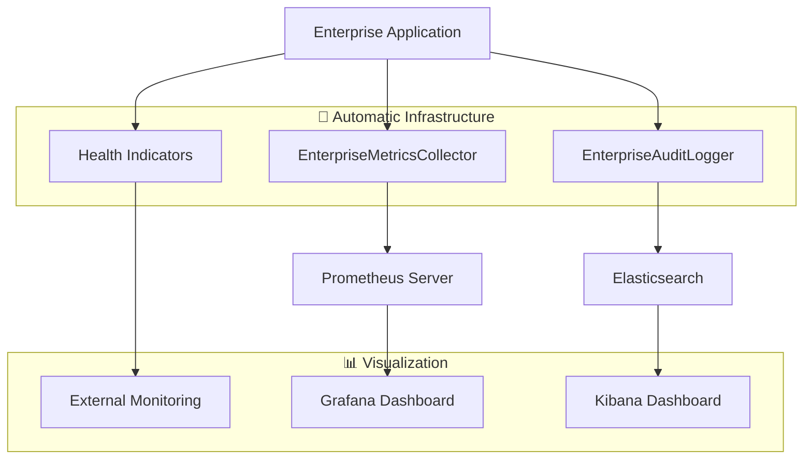

# Enterprise Framework - Monitoring & Metrics Guide

📊 **Complete guide for monitoring, metrics collection, and performance analysis in Enterprise Framework applications.**

This guide shows developers how to leverage the built-in monitoring infrastructure that's automatically generated with every Enterprise Framework microservice.

## 🎯 **Overview**

The Enterprise Framework provides **automatic enterprise-grade monitoring** with zero configuration required. Every generated microservice includes:

- **Automatic Metrics Collection** - Performance and business metrics via Micrometer/Prometheus
- **Enterprise Audit Trails** - Comprehensive JSON audit events for compliance
- **Health Monitoring** - Application health checks and readiness probes
- **Docker Monitoring Stack** - Grafana + Prometheus + ELK Stack ready to use
- **Business Intelligence** - Custom metrics for business KPIs and monitoring

## 🏗️ **Monitoring Architecture**



### Infrastructure Components

#### 🤖 **Automatic Infrastructure (Cannot be Modified)**
- **EnterpriseMetricsCollector**: Micrometer-based metrics collection
- **EnterpriseAuditLogger**: Structured JSON audit events
- **Health Indicators**: Spring Boot actuator health checks
- **Performance Interceptors**: Automatic timing and monitoring

#### 👨‍💻 **Business Customization (Developer Implements)**
- **Business Metrics**: Domain-specific KPIs and measurements
- **Custom Health Checks**: Business-specific health validations
- **Alert Rules**: Business logic-based alerting
- **Dashboard Customization**: Business-focused visualizations

## 📊 **Automatic Metrics Collection**

### Enterprise Metrics Categories

#### **1. Operation Metrics**
```java
// 🤖 Automatically collected by Enterprise Framework
enterprise.service.create.count{entity="product"}
enterprise.service.create.time{entity="product"}
enterprise.service.read.count{entity="product"}
enterprise.service.update.count{entity="product"}
enterprise.service.delete.count{entity="product"}
enterprise.service.search.count{entity="product"}
```

#### **2. Error Metrics**
```java
// 🤖 Automatically tracked
enterprise.service.validation.error{entity="product"}
enterprise.service.system.error{entity="product"}
enterprise.service.business.rule.violation{entity="product", rule="stock_validation"}
```

#### **3. Performance Metrics**
```java
// 🤖 Timing automatically measured
enterprise.service.create.time{entity="product", quantile="0.95"}
enterprise.service.database.query.time{entity="product"}
enterprise.cache.hit{entity="product"}
enterprise.cache.miss{entity="product"}
```

#### **4. Business Metrics**
```java
// 👨‍💻 Business-specific metrics (developer customizable)
product.inventory.low.stock.count
product.revenue.daily.total
product.user.engagement{operation="view", user="user123"}
```

### Using Enterprise Metrics in Your Business Logic

```java
@Service
public class ProductServiceImpl extends AbstractEnterpriseService<Product, String, ProductRequest, ProductRequest, ProductResponse> {

    @Autowired
    private EnterpriseMetricsCollector metricsCollector;

    // 👨‍💻 Add custom business metrics
    @Override
    protected void afterCreate(Product product, ProductRequest createDTO) {
        // 🤖 Standard metrics automatically collected

        // 👨‍💻 Add business-specific metrics
        if (product.getStock() < 10) {
            metricsCollector.recordBusinessMetric("low.stock.alert", 1,
                "category", product.getCategory());
        }

        metricsCollector.recordBusinessEvent("PRODUCT_CREATED", "PRODUCT");
    }
}
```

### Custom Metrics Service Example

```java
@Component
public class ProductBusinessMetrics {

    private final MeterRegistry meterRegistry;
    private final ProductRepository productRepository;

    @EventListener
    public void onProductCreated(ProductCreatedEvent event) {
        // Record revenue impact
        recordRevenueMetric(event.getProduct());

        // Record inventory metrics
        recordInventoryMetrics(event.getProduct().getCategory());

        // Record user engagement
        recordUserEngagement(event.getUserId(), "PRODUCT_CREATE");
    }

    private void recordRevenueMetric(Product product) {
        Gauge.builder("product.potential.revenue")
             .tag("category", product.getCategory())
             .register(meterRegistry, () -> calculatePotentialRevenue(product));
    }

    private void recordInventoryMetrics(String category) {
        Counter.builder("product.inventory.changes")
               .tag("category", category)
               .tag("operation", "CREATE")
               .register(meterRegistry)
               .increment();
    }
}
```

## 📋 **Audit Trails System**

### Automatic Audit Events

The Enterprise Framework automatically logs structured audit events for compliance:

#### **Operation Audit Events**
```json
{
  "auditId": "550e8400-e29b-41d4-a716-446655440000",
  "timestamp": "2024-01-15T10:30:00Z",
  "eventType": "OPERATION_SUCCESS",
  "operation": "CREATE",
  "entityType": "PRODUCT",
  "entityId": "PROD-123",
  "status": "SUCCESS",
  "userId": "user@company.com",
  "userRole": "ROLE_ADMIN",
  "sessionId": "SESSION_1705315800",
  "clientIpAddress": "192.168.1.100",
  "requestData": {
    "name": "New Product",
    "category": "ELECTRONICS",
    "price": 299.99
  },
  "responseData": {
    "id": "PROD-123",
    "status": "ACTIVE"
  }
}
```

#### **Security Audit Events**
```json
{
  "auditId": "660e8400-e29b-41d4-a716-446655440001",
  "timestamp": "2024-01-15T10:35:00Z",
  "eventType": "SECURITY_EVENT",
  "operation": "UNAUTHORIZED_ACCESS",
  "status": "HIGH",
  "description": "Failed authentication attempt",
  "securityRelevant": true,
  "userId": "unknown",
  "clientIpAddress": "192.168.1.200"
}
```

#### **Business Rule Violations**
```json
{
  "auditId": "770e8400-e29b-41d4-a716-446655440002",
  "timestamp": "2024-01-15T10:40:00Z",
  "eventType": "BUSINESS_RULE_VIOLATION",
  "operation": "VALIDATION",
  "entityType": "PRODUCT",
  "entityId": "PROD-124",
  "status": "RULE_VIOLATED",
  "ruleType": "STOCK_VALIDATION",
  "description": "Product stock cannot be negative",
  "userId": "user@company.com"
}
```

### Using Audit Logger in Business Logic

```java
@Component
public class ProductBusinessRules extends BusinessRules.AbstractBusinessRules<Product, ProductRequest, ProductRequest> {

    @Autowired
    private EnterpriseAuditLogger auditLogger;

    @Override
    public void applyCreateRules(Product entity, ProductRequest createDTO) {
        // Business rule: Check minimum price
        if (entity.getPrice().compareTo(BigDecimal.valueOf(10)) < 0) {
            // 👨‍💻 Log custom business rule violation
            auditLogger.logBusinessRuleViolation(
                "PRODUCT",
                entity.getId(),
                "MINIMUM_PRICE_RULE",
                "Product price must be at least $10.00"
            );

            throw new BusinessRuleViolationException("Price too low");
        }

        // 👨‍💻 Log business configuration change
        if (createDTO.getCategory() != null) {
            auditLogger.logConfigurationChange(
                "PRODUCT_CATEGORY",
                "category",
                null,
                createDTO.getCategory()
            );
        }
    }
}
```

### Audit Queries for Compliance

#### **SOX Compliance Queries (Elasticsearch/Kibana)**
```json
// All financial operations in the last quarter
{
  "query": {
    "bool": {
      "must": [
        {"term": {"eventType": "OPERATION_SUCCESS"}},
        {"terms": {"operation": ["CREATE", "UPDATE", "DELETE"]}},
        {"wildcard": {"entityType": "*FINANCIAL*"}},
        {"range": {"timestamp": {"gte": "2024-01-01", "lte": "2024-03-31"}}}
      ]
    }
  },
  "aggs": {
    "by_user": {"terms": {"field": "userId"}},
    "by_operation": {"terms": {"field": "operation"}}
  }
}
```

#### **GDPR Data Access Audit**
```json
// All data access events for specific user
{
  "query": {
    "bool": {
      "must": [
        {"term": {"eventType": "DATA_ACCESS"}},
        {"wildcard": {"entityId": "USER-12345*"}},
        {"range": {"timestamp": {"gte": "2024-01-01"}}}
      ]
    }
  },
  "sort": [{"timestamp": {"order": "desc"}}]
}
```

#### **Security Incident Analysis**
```json
// All security events in the last 24 hours
{
  "query": {
    "bool": {
      "must": [
        {"term": {"securityRelevant": true}},
        {"range": {"timestamp": {"gte": "now-24h"}}}
      ]
    }
  },
  "aggs": {
    "by_ip": {"terms": {"field": "clientIpAddress"}},
    "by_severity": {"terms": {"field": "status"}}
  }
}
```

## 🏥 **Health Monitoring**

### Built-in Health Checks

```java
// 🤖 Automatic health checks (cannot be modified)
GET /api/v1/actuator/health
{
  "status": "UP",
  "components": {
    "diskSpace": {"status": "UP"},
    "db": {"status": "UP"},
    "redis": {"status": "UP"},
    "enterprise": {"status": "UP"}
  }
}

// Liveness probe
GET /api/v1/actuator/health/liveness
{"status": "UP"}

// Readiness probe
GET /api/v1/actuator/health/readiness
{"status": "UP"}
```

### Custom Business Health Indicators

```java
@Component
public class ProductHealthIndicator implements HealthIndicator {

    @Autowired
    private ProductService productService;

    @Override
    public Health health() {
        try {
            // 👨‍💻 Business-specific health checks
            long productCount = productService.getTotalCount();
            long lowStockCount = productService.getLowStockCount();

            if (lowStockCount > productCount * 0.5) {
                return Health.down()
                    .withDetail("reason", "Too many products with low stock")
                    .withDetail("lowStockCount", lowStockCount)
                    .withDetail("totalCount", productCount)
                    .build();
            }

            return Health.up()
                .withDetail("totalProducts", productCount)
                .withDetail("lowStockProducts", lowStockCount)
                .build();

        } catch (Exception e) {
            return Health.down(e).build();
        }
    }
}
```

## 🐳 **Docker Monitoring Stack**

### Complete Monitoring Environment

```bash
# Start the complete monitoring stack
docker-compose up -d

# Services available:
# - Application: http://localhost:8080
# - Grafana: http://localhost:3000 (admin/admin)
# - Prometheus: http://localhost:9090
# - Kibana: http://localhost:5601
# - RabbitMQ Management: http://localhost:15672 (admin/password)
```

### Environment Variables for Monitoring

```yaml
# docker-compose.yml monitoring configuration
environment:
  - MANAGEMENT_ENDPOINTS_WEB_EXPOSURE_INCLUDE=health,info,metrics,prometheus
  - MANAGEMENT_ENDPOINT_HEALTH_SHOW_DETAILS=always
  - MANAGEMENT_METRICS_EXPORT_PROMETHEUS_ENABLED=true
  - LOGGING_LEVEL_AUDIT=INFO
  - LOGGING_PATTERN_FILE=%d{ISO8601} [%thread] %-5level %logger{36} - %msg%n
```

## 📈 **Prometheus Queries**

### Essential Enterprise Queries

#### **Application Performance**
```promql
# Average request duration by operation
rate(enterprise_service_create_time_sum[5m]) / rate(enterprise_service_create_time_count[5m])

# Request rate by entity type
sum(rate(enterprise_service_operations_total[5m])) by (entity, operation)

# Error rate percentage
(sum(rate(enterprise_service_errors_total[5m])) / sum(rate(enterprise_service_operations_total[5m]))) * 100

# 95th percentile response time
histogram_quantile(0.95, sum(rate(enterprise_service_create_time_bucket[5m])) by (le, entity))
```

#### **Business Metrics**
```promql
# Products created per hour
increase(enterprise_service_creation_success{entity="product"}[1h])

# Cache hit rate
(sum(rate(enterprise_cache_hit[5m])) / (sum(rate(enterprise_cache_hit[5m])) + sum(rate(enterprise_cache_miss[5m])))) * 100

# Business rule violations trend
increase(enterprise_service_business_rule_violation[1h])

# User engagement by operation
sum(rate(product_user_engagement[5m])) by (operation)
```

#### **System Health**
```promql
# JVM memory usage
jvm_memory_used_bytes{area="heap"} / jvm_memory_max_bytes{area="heap"} * 100

# Database connection pool usage
hikaricp_connections_active / hikaricp_connections_max * 100

# Garbage collection time
rate(jvm_gc_collection_seconds_sum[5m])
```

### Alert Rules Example

```yaml
# alerts.yml
groups:
  - name: enterprise_application
    rules:
      - alert: HighErrorRate
        expr: (sum(rate(enterprise_service_errors_total[5m])) / sum(rate(enterprise_service_operations_total[5m]))) * 100 > 5
        for: 2m
        labels:
          severity: warning
        annotations:
          summary: "High error rate detected"
          description: "Error rate is {{ $value }}% for the last 5 minutes"

      - alert: HighResponseTime
        expr: histogram_quantile(0.95, sum(rate(enterprise_service_create_time_bucket[5m])) by (le)) > 2
        for: 1m
        labels:
          severity: critical
        annotations:
          summary: "High response time"
          description: "95th percentile response time is {{ $value }}s"

      - alert: LowCacheHitRate
        expr: (sum(rate(enterprise_cache_hit[5m])) / (sum(rate(enterprise_cache_hit[5m])) + sum(rate(enterprise_cache_miss[5m])))) * 100 < 80
        for: 5m
        labels:
          severity: warning
        annotations:
          summary: "Low cache hit rate"
          description: "Cache hit rate is {{ $value }}%"
```

## 📊 **Development Workflow**

### 1. **Start Monitoring Stack**
```bash
# Initialize development environment with monitoring
enterprise dev setup --docker

# Start application with monitoring enabled
enterprise dev start --full-stack

# View real-time logs and metrics
enterprise dev logs --follow
```

### 2. **Access Monitoring Tools**
```bash
# Application metrics endpoint
curl http://localhost:8080/api/v1/actuator/prometheus

# Application health
curl http://localhost:8080/api/v1/actuator/health | jq

# View Grafana dashboards
open http://localhost:3000

# Query Prometheus directly
open http://localhost:9090
```

### 3. **Business Metrics Development**
```java
// 👨‍💻 Add business metrics during development
@Service
public class ProductAnalyticsService {

    @Autowired
    private EnterpriseMetricsCollector metricsCollector;

    @EventListener
    public void onProductEvent(ProductEvent event) {
        // Track business KPIs
        metricsCollector.recordBusinessMetric(
            "revenue.impact",
            event.getProduct().getPrice().doubleValue(),
            "category", event.getProduct().getCategory()
        );
    }
}
```

### 4. **Test Monitoring**
```java
@Test
public void testMetricsCollection() {
    // Create product and verify metrics
    ProductRequest request = new ProductRequest("Test Product", BigDecimal.valueOf(100));
    productService.create(request);

    // Verify metrics were recorded
    MetricsSummary summary = metricsCollector.getMetricsSummary(Product.class);
    assertThat(summary.getCreations()).isEqualTo(1);
}

@Test
public void testAuditLogging() {
    // Perform operation that should be audited
    productService.create(new ProductRequest("Audited Product", BigDecimal.valueOf(50)));

    // Verify audit event was logged
    // (In real implementation, would check audit log or database)
}
```

## 🎯 **Monitoring Best Practices**

### **1. Enterprise Framework Approach**
- **🤖 Infrastructure automatic**: Metrics, audit, health checks work out of the box
- **👨‍💻 Business focus**: Only implement business-specific monitoring logic
- **📊 Standard patterns**: Consistent monitoring across all microservices
- **🔍 Compliance ready**: Audit trails meet enterprise compliance requirements

### **2. Business Metrics Strategy**
```java
// ✅ Good: Business-focused metrics
metricsCollector.recordBusinessMetric("order.value", orderTotal, "customer", customerId);
metricsCollector.recordBusinessEvent("CUSTOMER_PURCHASE", "ORDER");

// ❌ Avoid: Infrastructure metrics (already automatic)
// Don't manually track: HTTP requests, database connections, JVM stats
```

### **3. Audit Trail Strategy**
```java
// ✅ Good: Business rule violations and security events
auditLogger.logBusinessRuleViolation("PRODUCT", productId, "PRICE_VALIDATION", "Price exceeds limit");
auditLogger.logSecurityEvent("ADMIN_ACCESS", "Administrative function accessed", "HIGH");

// ✅ Good: Data access for compliance
auditLogger.logDataAccess("CUSTOMER", customerId, "READ");

// ❌ Avoid: Over-auditing technical operations (automatic)
```

### **4. Dashboard Design**
- **Business KPIs**: Revenue, user engagement, conversion rates
- **Operational health**: Error rates, response times, availability
- **Compliance views**: Audit trails, security events, data access
- **Performance trends**: Historical data, capacity planning

## 🚀 **Production Deployment**

### **Monitoring Configuration**
```yaml
# production application.yml
management:
  endpoints:
    web:
      exposure:
        include: health,info,metrics,prometheus
  endpoint:
    health:
      show-details: when-authorized
  metrics:
    export:
      prometheus:
        enabled: true
    tags:
      service: ${spring.application.name}
      environment: ${spring.profiles.active}

logging:
  level:
    AUDIT: INFO
  pattern:
    file: "%d{ISO8601} [%X{correlationId}] [%thread] %-5level %logger{36} - %msg%n"
```

### **Kubernetes Monitoring**
```yaml
# k8s/monitoring.yaml
apiVersion: v1
kind: ServiceMonitor
metadata:
  name: enterprise-app-metrics
spec:
  selector:
    matchLabels:
      app: enterprise-app
  endpoints:
  - port: http
    path: /api/v1/actuator/prometheus
    interval: 30s
```

### **Production Alerts**
```yaml
# Critical business alerts
- alert: BusinessRuleViolationSpike
  expr: increase(enterprise_service_business_rule_violation[1h]) > 100
  labels:
    severity: critical
  annotations:
    summary: "High number of business rule violations"

- alert: RevenueDropAlert
  expr: sum(increase(product_potential_revenue[1h])) < 1000
  labels:
    severity: warning
  annotations:
    summary: "Revenue below expected threshold"
```

---

**Enterprise Framework Monitoring** - Automatic enterprise-grade monitoring with business focus.

> 💡 **Philosophy**: The best monitoring is invisible to developers until they need business insights. Infrastructure monitoring is automatic - developers focus on business KPIs and compliance.

> 🎯 **Key Benefit**: **Zero-configuration enterprise monitoring** with Prometheus, Grafana, audit trails, and health checks working automatically from day one.