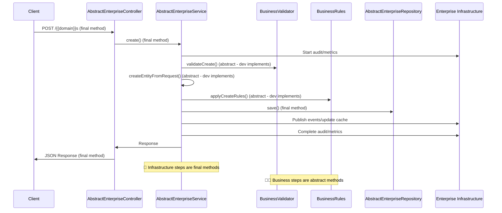

# {{serviceNameTitleCase}} - Enterprise Framework Microservice 🚀

[](https://github.com/company/{{serviceName}}/actions/workflows/ci-cd.yml)
[](https://codecov.io/gh/company/{{serviceName}})
[](https://sonarcloud.io/dashboard?id={{serviceName}})
[](https://sonarcloud.io/dashboard?id={{serviceName}})

🎯 **Enterprise Framework microservice where developers implement ONLY business logic - all infrastructure is automatic and cannot be modified.**

This {{domainTitleCase}} microservice is built using the **Enterprise Framework** approach that "blinds" all infrastructure code and forces developers to focus exclusively on business value. Transactions, caching, metrics, audit, events, security - all handled automatically.

## 📋 Table of Contents

- [Overview](#overview)
- [Features](#features)
- [Architecture](#architecture)
- [Quick Start](#quick-start)
- [Development](#development)
- [Testing](#testing)
- [Deployment](#deployment)
- [API Documentation](#api-documentation)
- [Monitoring](#monitoring)
- [Security](#security)
- [Contributing](#contributing)
- [License](#license)

## 🔍 **Enterprise Framework Overview**

The {{serviceNameTitleCase}} demonstrates the **Enterprise Framework** approach where:

- 🤖 **Infrastructure is "Blinded"** - Cannot be modified by developers (final methods)
- 👨‍💻 **Business Logic Only** - Developers implement only domain-specific logic
- 🏗️ **Template Method Pattern** - Framework orchestrates, developers provide business steps
- 📚 **Strategy Pattern** - Business validation and rules are interchangeable implementations

### What Developers Implement (Business Logic Only)
- **{{domainTitleCase}}BusinessValidator** - Domain-specific validation rules
- **{{domainTitleCase}}BusinessRules** - Business logic and policies
- **{{domainTitleCase}}ServiceImpl** - Business interface implementation
- **{{domainTitleCase}}Controller** - Business-specific endpoints

### What Framework Provides (Automatic Infrastructure)
- **Transactions** - Automatic transaction boundaries for all operations
- **Caching** - Entity-level caching with automatic invalidation
- **Metrics** - Business and technical metrics collection
- **Audit** - Comprehensive JSON audit events for compliance
- **Events** - Domain event publishing with correlation IDs
- **Security** - Input validation, error handling, security headers
- **Performance** - Automatic optimization and monitoring

## ✨ **Enterprise Framework Features**

### 🤖 **Automatic Infrastructure (No Developer Code Required)**
- 🔧 **Complete CRUD Operations** - AbstractEnterpriseService handles all operations
- 🔍 **Enterprise Search** - Global text search with JPA Specifications
- 📄 **Pagination & Filtering** - Optimized for large datasets
- 🔄 **Business Validation** - Orchestrated through BusinessValidator interface
- 🛡️ **Enterprise Security** - OAuth2, JWT, CORS, security headers automatic
- 📊 **Comprehensive Monitoring** - Health checks, metrics, distributed tracing
- 🚀 **Performance Optimization** - Caching, connection pooling, query optimization
- 🔌 **Domain Events** - Automatic event publishing for microservice communication
- 📚 **OpenAPI Documentation** - Auto-generated with business context

### 👨‍💻 **Business Implementation (Developer Focus Areas)**
- 🎯 **Domain Validation** - Business-specific validation rules and constraints
- 📋 **Business Rules** - Domain logic, policies, state transitions
- 🔍 **Custom Search** - Business-specific search criteria and filters
- 🌐 **Business Endpoints** - Domain-specific API operations beyond standard CRUD
- 🗂️ **Entity Mapping** - Pure business data transformation

### Technical Stack
- **Framework**: Spring Boot 3.2.0
- **Language**: Java 17
- **Database**: {{#postgresql}}PostgreSQL{{/postgresql}}{{#mysql}}MySQL{{/mysql}}{{#h2}}H2 (Development){{/h2}}
- **Cache**: Caffeine
- **Documentation**: OpenAPI 3.0
- **Testing**: JUnit 5, TestContainers, MockMvc
- **Build**: Maven
- **Containerization**: Docker
- **Orchestration**: Kubernetes

## 🏗️ **Enterprise Framework Architecture**

```mermaid
graph TB
    Client[Client Applications] --> LB[Load Balancer]
    LB --> API[{{serviceNameTitleCase}}]

    API --> Cache[Automatic Caching]
    API --> DB[{{#postgresql}}PostgreSQL{{/postgresql}}{{#mysql}}MySQL{{/mysql}}{{#h2}}H2 Database{{/h2}}]
    API --> Events[Domain Events]

    API --> Metrics[Enterprise Metrics]
    API --> Audit[Audit Logs]

    subgraph "🤖 INFRASTRUCTURE LAYER (Cannot be Modified)"
        AbstractController[AbstractEnterpriseController]
        AbstractService[AbstractEnterpriseService]
        AbstractRepository[AbstractEnterpriseRepository]
        EnterpriseAudit[EnterpriseAuditLogger]
        EnterpriseMetrics[EnterpriseMetricsCollector]
        EnterpriseEvents[EnterpriseEventPublisher]
    end

    subgraph "👨‍💻 BUSINESS LOGIC LAYER (Developer Implements)"
        BusinessValidator[{{domainTitleCase}}BusinessValidator]
        BusinessRules[{{domainTitleCase}}BusinessRules]
        ServiceImpl[{{domainTitleCase}}ServiceImpl]
        ControllerImpl[{{domainTitleCase}}Controller]
        Entity[{{domainTitleCase}} Entity]
    end

    AbstractController --> AbstractService
    AbstractService --> AbstractRepository
    AbstractService --> BusinessValidator
    AbstractService --> BusinessRules
    AbstractService --> EnterpriseAudit
    AbstractService --> EnterpriseMetrics
    AbstractService --> EnterpriseEvents

    ControllerImpl -.extends.-> AbstractController
    ServiceImpl -.extends.-> AbstractService
    Entity -.annotated.-> Enterprise[Enterprise Annotations]
```

### 🏗️ **Layer Architecture Principles**

#### 🤖 **Infrastructure Layer (Framework - Cannot Modify)**
- **AbstractEnterpriseController**: Standardized REST endpoints with final methods
- **AbstractEnterpriseService**: Template Method pattern for CRUD operations (final methods)
- **AbstractEnterpriseRepository**: JPA Specification patterns with enterprise queries
- **Enterprise Infrastructure**: Audit, Metrics, Events - automatic operation

**Key Constraint**: All infrastructure methods are `final` - developers cannot override or modify infrastructure behavior.

#### 👨‍💻 **Business Logic Layer (Developer Implements)**
- **{{domainTitleCase}}BusinessValidator**: Domain validation rules using Strategy pattern
- **{{domainTitleCase}}BusinessRules**: Business logic and policies using Strategy pattern
- **{{domainTitleCase}}ServiceImpl**: Business interface implementation extending AbstractEnterpriseService
- **{{domainTitleCase}}Controller**: Business-specific endpoints extending AbstractEnterpriseController
- **{{domainTitleCase}} Entity**: Domain model with @EnterpriseEntity configuration

**Developer Focus**: 100% business logic implementation - infrastructure handled automatically.

### 🔄 **Template Method Pattern Flow**



## 🚀 Quick Start

### Prerequisites

- **Java 17** or higher
- **Maven 3.6+**
- **Docker** (optional, for containerized setup)
{{#postgresql}}
- **PostgreSQL 12+** (for production)
{{/postgresql}}
{{#mysql}}
- **MySQL 8.0+** (for production)
{{/mysql}}

### Local Development

1. **Clone the repository**
   ```bash
   git clone https://github.com/company/{{serviceName}}.git
   cd {{serviceName}}
   ```

2. **Run with Maven** (uses H2 in-memory database)
   ```bash
   mvn spring-boot:run
   ```

3. **Access the application**
   - API: http://localhost:8080/api/v1
   - Swagger UI: http://localhost:8080/api/v1/swagger-ui/index.html
   - Health Check: http://localhost:8080/api/v1/actuator/health

### Docker Setup

1. **Build and run with Docker Compose**
   ```bash
   docker-compose up -d
   ```

2. **Access services**
   - Application: http://localhost:8080
   {{#postgresql}}
   - PostgreSQL: localhost:5432
   {{/postgresql}}
   {{#mysql}}
   - MySQL: localhost:3306
   {{/mysql}}
   - Redis: localhost:6379
   - Prometheus: http://localhost:9090
   - Grafana: http://localhost:3000 (admin/admin)

## 💻 Development

### Project Structure

```
{{serviceName}}/
├── src/
│   ├── main/
│   │   ├── java/{{packagePath}}/
│   │   │   ├── controller/          # REST controllers
│   │   │   ├── service/             # Business services
│   │   │   ├── repository/          # Data repositories
│   │   │   ├── entity/              # JPA entities
│   │   │   ├── dto/                 # Data transfer objects
│   │   │   ├── config/              # Configuration classes
│   │   │   ├── exception/           # Exception handling
│   │   │   └── camel/               # Integration routes
│   │   └── resources/
│   │       ├── application.yml      # Configuration
│   │       └── db/migration/        # Database migrations
│   └── test/
│       ├── java/                    # Test classes
│       └── resources/               # Test resources
├── k8s/                             # Kubernetes manifests
├── docker-compose.yml               # Development environment
├── Dockerfile                       # Container image
└── README.md                        # This file
```

### Development Guidelines

1. **Code Style**: Follow Google Java Style Guide
2. **Testing**: Maintain 80%+ test coverage
3. **Documentation**: Update OpenAPI specifications
4. **Security**: Never commit secrets or credentials
5. **Performance**: Consider caching and query optimization

### Available Profiles

- `dev` - Development (H2 database, debug logging)
- `test` - Testing (H2 in-memory, fast startup)
- `prod` - Production (external database, optimized settings)

## 🧪 Testing

### Running Tests

```bash
# Unit tests
mvn test

# Integration tests
mvn verify -P integration

# All tests with coverage
mvn clean verify
```

### Test Categories

- **Unit Tests**: Fast, isolated tests for business logic
- **Integration Tests**: Database and external service integration
- **Contract Tests**: API contract validation
- **Performance Tests**: Load and stress testing with JMeter

### Test Coverage

The project maintains high test coverage across all layers:
- Controllers: REST endpoint testing with MockMvc
- Services: Business logic testing with Mockito
- Repositories: Data access testing with @DataJpaTest
- Integration: End-to-end testing with TestContainers

## 🚢 Deployment

### Container Deployment

```bash
# Build image
docker build -t {{serviceName}}:latest .

# Run container
docker run -p 8080:8080 {{serviceName}}:latest
```

### Kubernetes Deployment

```bash
# Apply manifests
kubectl apply -f k8s/

# Check deployment status
kubectl rollout status deployment/{{serviceName}}

# View logs
kubectl logs -f deployment/{{serviceName}}
```

### Environment Variables

| Variable | Description | Default |
|----------|-------------|---------|
| `SPRING_PROFILES_ACTIVE` | Active Spring profile | `prod` |
| `SPRING_DATASOURCE_URL` | Database connection URL | - |
| `SPRING_DATASOURCE_USERNAME` | Database username | - |
| `SPRING_DATASOURCE_PASSWORD` | Database password | - |
| `JAVA_OPTS` | JVM options | `-XX:+UseContainerSupport` |

## 📚 API Documentation

### Interactive Documentation

- **Swagger UI**: `/api/v1/swagger-ui/index.html`
- **OpenAPI Spec**: `/api/v1/api-docs`

### Main Endpoints

| Method | Endpoint | Description |
|--------|----------|-------------|
| `GET` | `/{{domain}}s` | List all {{domain}}s |
| `GET` | `/{{domain}}s/{id}` | Get {{domain}} by ID |
| `POST` | `/{{domain}}s` | Create new {{domain}} |
| `PUT` | `/{{domain}}s/{id}` | Update {{domain}} |
| `DELETE` | `/{{domain}}s/{id}` | Delete {{domain}} |
| `GET` | `/{{domain}}s/search` | Search {{domain}}s |

### Authentication

The API supports multiple authentication methods:

1. **Bearer Token (JWT)**
   ```bash
   curl -H "Authorization: Bearer <token>" \
        http://localhost:8080/api/v1/{{domain}}s
   ```

2. **Basic Authentication**
   ```bash
   curl -u user:password \
        http://localhost:8080/api/v1/{{domain}}s
   ```

## 📊 Monitoring

### Health Checks

- **Liveness**: `/actuator/health/liveness`
- **Readiness**: `/actuator/health/readiness`
- **Overall Health**: `/actuator/health`

### Metrics

- **Application Metrics**: `/actuator/metrics`
- **Prometheus**: `/actuator/prometheus`
- **JVM Metrics**: Memory, GC, threads

### Logging

- **Structured Logging**: JSON format for production
- **Log Levels**: Configurable per package
- **Correlation IDs**: Request tracing support

## 🔒 Security

### Security Features

- **Authentication**: OAuth2/JWT and Basic Auth
- **Authorization**: Role-based access control
- **CORS**: Configurable cross-origin policies
- **Security Headers**: HSTS, CSP, XSS protection
- **Input Validation**: Comprehensive data validation

### Security Scanning

- **Dependency Check**: OWASP dependency scanning
- **Container Scanning**: Trivy vulnerability assessment
- **Code Analysis**: SonarQube security rules
- **Secret Detection**: Git hooks for credential scanning

## 🤝 Contributing

We welcome contributions! Please see our [Contributing Guidelines](CONTRIBUTING.md) for details.

### Development Process

1. Fork the repository
2. Create a feature branch (`git checkout -b feature/amazing-feature`)
3. Make your changes
4. Add tests for new functionality
5. Ensure all tests pass (`mvn verify`)
6. Commit your changes (`git commit -m 'Add amazing feature'`)
7. Push to your branch (`git push origin feature/amazing-feature`)
8. Open a Pull Request

### Code Review Checklist

- [ ] Tests added/updated
- [ ] Documentation updated
- [ ] Security considerations addressed
- [ ] Performance impact assessed
- [ ] Breaking changes documented

## 📄 License

This project is licensed under the Apache License 2.0 - see the [LICENSE](LICENSE) file for details.

## 🔗 Links

- [API Documentation](https://{{serviceName}}.company.com/swagger-ui/)
- [Monitoring Dashboard](https://grafana.company.com/d/{{serviceName}})
- [Issue Tracker](https://github.com/company/{{serviceName}}/issues)
- [Wiki](https://github.com/company/{{serviceName}}/wiki)

## 👥 Support

- **Email**: api-support@company.com
- **Slack**: #{{serviceName}}-support
- **Documentation**: https://docs.company.com/{{serviceName}}

---

**Generated by Enterprise CLI** - [Learn more](https://github.com/company/enterprise-cli)